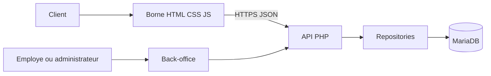
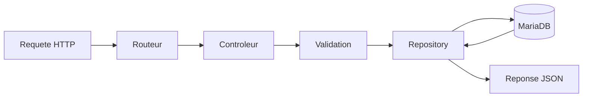

# Dossier professionnel - Projet WACDO

## 1. Presentation generale

**Projet :** WACDO, solution de commande pour une chaine de restauration rapide.

**Porteur du projet :** Quentin

**Objectif :** concevoir une solution permettant a un client de composer une commande sur une borne, puis de permettre au personnel de suivre et traiter cette commande depuis un back-office.

Le projet comprend plusieurs parties complementaires :

- une borne client ;
- un front-end en HTML, CSS et JavaScript vanilla ;
- une API PHP ;
- un back-office pour le suivi et la gestion ;
- une base de donnees MariaDB ;
- une infrastructure Docker ;
- une partie Framework correspondant a l'option retenue dans le cadre de l'examen.

Le dossier presente les recherches, les choix techniques, les realisations, les limites connues et les pistes d'evolution. Chaque choix est relie a un besoin concret du projet.

---

## 2. Contexte et problematique

Dans un restaurant a service rapide, la prise de commande doit etre simple pour le client et fiable pour l'equipe. Une erreur de prix, de stock ou de transmission de commande peut ralentir le service et creer une insatisfaction.

La problematique retenue est donc la suivante :

> Comment permettre a un client de passer rapidement une commande, tout en donnant au restaurant une application fiable pour controler les prix, les stocks et l'avancement des commandes ?

La solution repond a cette problematique en separant les responsabilites :

- le front affiche le catalogue et recueille les choix du client ;
- l'API controle les donnees et applique les regles metier ;
- la base conserve les informations ;
- le back-office permet au personnel de suivre les commandes ;
- les roles limitent l'acces aux fonctions sensibles.

Cette separation constitue un choix important : le navigateur ne doit pas etre considere comme une source de verite pour les prix, les stocks ou les droits d'acces.

---

## 3. Recherches et demarche de conception

### 3.1 Analyse du besoin

La conception a commence par l'identification des acteurs et des parcours :

| Acteur | Besoin principal |
|---|---|
| Client | Consulter le catalogue et passer une commande |
| Employe d'accueil | Saisir, consulter et remettre une commande |
| Equipe de preparation | Voir les commandes a preparer et les marquer comme pretes |
| Manager ou administrateur | Gerer les produits, menus, ingredients et utilisateurs |
| Jury ou mainteneur | Comprendre l'architecture et faire evoluer le projet |

### 3.2 Recherche documentaire

Les recherches ont porte sur :

- les attendus des blocs front-end, back-end et Framework ;
- la modelisation relationnelle et les associations entre entites ;
- l'architecture MVC et la programmation orientee objet en PHP ;
- les echanges entre une interface web et une API JSON ;
- l'authentification par session et l'autorisation par role ;
- la validation des donnees et la gestion des erreurs ;
- le fonctionnement des conteneurs Docker ;
- l'interet d'un framework pour organiser un front ou un back ;
- les besoins de tests fonctionnels, d'integration et de parcours utilisateur.

Les documents de cadrage officiels ont servi a comparer les fonctionnalites attendues avec les fonctionnalites implementees. Le cadre de l'examen proposait plusieurs orientations pour le bloc Framework ; l'orientation retenue est integree au dossier comme une partie distincte du projet. Cette comparaison est reprise dans la matrice de couverture presentee plus loin.

### 3.3 Methode de travail

La conception a suivi une progression par etapes :

1. comprendre le besoin et les utilisateurs ;
2. definir le vocabulaire metier ;
3. modeliser les donnees ;
4. concevoir l'architecture ;
5. developper l'API et les acces a la base ;
6. preparer les chemins d'echange entre le front et le back-office ;
7. deployer dans des conteneurs ;
8. verifier les parcours critiques ;
9. relever les limites et preparer les evolutions.

Cette methode permet de justifier les decisions avant de coder et de conserver des preuves intermediaires : MCD, MPD, diagrammes de classes, contrat API, scripts de migration et documentation.

### 3.4 Etat actuel de realisation (18/09/2026)

Le projet est aujourd'hui dans une phase de finalisation technique, avec un cadrage clair et une base fonctionnelle solide. La logique suivie a ete la suivante :

- retenir la logique d'organisation du projet et la separation des services ;
- conserver le modele metier, les MPD/MCD et les donnees propres au projet ;
- separer la base, les migrations, le seed, l'application PHP et le front statique ;
- conserver la logique d'integration Traefik et du reseau hote, sans modifier l'infrastructure existante du serveur ;
- maintenir un niveau de production raisonnable en mode override local, sans casser le fonctionnement de la stack.

A l'heure actuelle, la base de travail est stable et la structure est coherente. Le projet contient une architecture de deploiement reproductible et une separation claire des roles entre la base, l'API, le front et le contexte serveur. La version presentee utilise l'API pour le catalogue et la creation de commande, avec un choix de compte client facultatif.

Le point de vigilance a bien distinguer est le suivant : la validation du service PHP ne s'effectue pas par un simple appel `localhost` brut, mais par le contexte Docker/Traefik et les domaines ou points d'entree du projet. La stack est coherent, mais les chemins d'acces externes doivent rester alignes sur l'infrastructure hote et non sur un simple port local non expose.

---

## 4. Modelisation et structure des donnees

### 4.1 Entites principales

Le modele comprend notamment :

- `ROLES` et `UTILISATEURS` pour les comptes internes ;
- `COMMANDES` pour les commandes ;
- `STATUTS_COMMANDES` pour le cycle de vie ;
- `CANAUX` pour distinguer la borne et les autres canaux ;
- `PRODUITS`, `MENUS` et `CATEGORIES` pour le catalogue ;
- `INGREDIENTS` pour le stock ;
- les tables d'association entre commandes, menus, produits, categories et ingredients.

### 4.2 Justification du modele relationnel

MariaDB a ete retenue car les donnees sont fortement liees. Une commande contient plusieurs lignes, un menu contient plusieurs produits, un produit peut appartenir a plusieurs categories et un produit peut consommer plusieurs ingredients.

Les tables d'association permettent de representer proprement les relations plusieurs-a-plusieurs :

- `menu_produit` ;
- `produits_categories` ;
- `ingredients_produits` ;
- `commande_produit` ;
- `commande_menu`.

Le modele evite de stocker des informations complexes dans une seule colonne et facilite les controles par cle etrangere.

### 4.3 Decisions importantes

- `commandes.id_user` est nullable afin d'autoriser une commande anonyme ;
- `numero_ticket` est unique pour identifier une commande ;
- les roles, statuts et canaux sont separes afin d'eviter des valeurs dispersees dans le code ;
- les prix sont stockes en `DECIMAL(10,2)` ;
- les images sont stockees avec leur type MIME ;
- les migrations permettent de reconstruire la structure de la base ;
- les donnees initiales sont injectees par un script de seed.

### 4.4 Preuves dans le projet

- MCD : `wacdo/architecture/MCD.mmd` ;
- MPD : `wacdo/architecture/MPD.sql` ;
- dictionnaire de donnees : `wacdo/architecture/Dictionnaire_de_données.csv` ;
- diagrammes de classes : `wacdo/architecture/class-diagram.mmd` et `wacdo/architecture/class-diagram-app.mmd` ;
- migration : `db/migrations/0001_init_schema.php`.

---

## 5. Recherche et justification des choix de langage

### 5.1 Recherche du langage serveur

Le langage serveur n'a pas ete retenu au hasard. La recherche a porte sur plusieurs criteres : capacite a construire une API web, compatibilite avec l'hebergement disponible, acces a une base SQL, gestion des sessions, possibilite de programmer en objet et facilite de maintenance.

PHP a ete retenu car il repond a ces criteres et s'inscrit naturellement dans l'ecosysteme web utilise pour le projet. Il permet de construire une application web et une API avec une separation claire entre le routage, les controles, la logique metier et l'acces aux donnees.

Le projet utilise PHP 8.3 et la programmation orientee objet. Le choix d'une architecture sans framework PHP dans cette partie rend visibles les fondamentaux que le projet devait demontrer :

- point d'entree HTTP ;
- routage ;
- controleurs ;
- modeles ;
- repositories ;
- acces PDO ;
- sessions ;
- reponses JSON ;
- gestion des erreurs.

Ce choix n'est pas un refus des frameworks. Il permet d'abord de comprendre et de justifier les mecanismes sur lesquels un framework s'appuie ensuite. Le choix du Framework pour le bloc dedie est traite separement dans la section 11.

### 5.2 Recherche du systeme de gestion de donnees

La base de donnees a ete choisie en comparant les besoins du projet : relations entre entites, contraintes d'integrite, transactions, stockage des prix, gestion des migrations, compatibilite avec PHP et possibilite de travailler avec des requetes preparees.

MariaDB a ete retenue car elle correspond a ces besoins relationnels et s'integre avec PDO. Ce choix permet de representer les commandes, les menus, les produits, les ingredients, les utilisateurs, les roles et les statuts avec des cles etrangeres et des tables d'association.

### 5.3 JavaScript pour le navigateur

Le front de borne utilise JavaScript vanilla pour gerer les interactions avec l'API sans ajouter de dependance necessaire a la premiere version :

- chargement du catalogue ;
- navigation entre categories ;
- ajout et modification du panier ;
- configuration des menus ;
- ouverture et fermeture des modales ;
- preparation du contenu de commande ;
- choix de connexion, de creation de compte ou de commande anonyme ;
- envoi de la commande a l'API ;
- affichage du ticket et du total retournes par le serveur.

Le code est organise autour d'un etat central et de fonctions distinctes pour le chargement, la normalisation des donnees, l'affichage et les evenements.

### 5.4 HTML et CSS

HTML fournit la structure semantique des ecrans. CSS gere la presentation de la borne, l'adaptation aux resolutions et l'organisation visuelle du parcours.

La borne est pensee pour une resolution principale de borne tout en conservant une adaptation aux dimensions disponibles.

---

## 6. Architecture applicative

### 6.1 Vue generale



### 6.2 Organisation du code

```text
index.php
app/
  Controllers/
  Exceptions/
  Http/
  Models/
  Repositories/
  Security/
  Views/
assets/
  css/
  js/
config/
db/
docker/
wacdo/architecture/
```

### 6.3 Flux d'une requete API



Les controleurs gerent la requete et la reponse. Les repositories regroupent les requetes SQL. Cette separation limite le melange entre HTTP et persistance et facilite les tests ou les evolutions.

---

## 7. Front-end vanilla de la borne

### 7.1 Fonctionnement

Le fichier principal est `assets/js/borne.js`. Dans la version presentee, la borne fonctionne en mode statique : le catalogue est lu depuis `/wacdo/produits.json` et la commande est simulee localement (ticket de test), sans appel a `GET /api/catalogue` ni `POST /api/commandes`. Les routes serveur de connexion et creation de compte client (`/api/auth/client-login`, `/api/auth/register`) existent et sont protegees, mais ne sont pas branchees sur ce front ; la commande reste donc anonyme et `COMMANDES.id_user` reste nul.

Le parcours principal est :

1. affichage des categories ;
2. affichage des produits et menus ;
3. ajout d'un produit ou d'un menu ;
4. configuration de la commande ;
5. affichage du panier ;
6. choix du mode de service ;
7. preparation de la commande ;
8. choix du compte client ou du mode invite ;
9. envoi et validation de la commande par l'API ;
10. affichage du numero de ticket.

### 7.2 Pourquoi commencer par du vanilla

Le front vanilla a permis de :

- valider rapidement le parcours fonctionnel ;
- limiter les dependances au debut du projet ;
- comprendre le cycle donnees -> etat -> affichage ;
- preparer la structure du contrat entre la borne et l'API ;
- garder une borne legere a deployer.

Le choix est coherent avec une premiere version qui devait surtout valider le besoin et les flux metier.

### 7.3 Limites identifiees

Le JavaScript vanilla devient plus difficile a maintenir lorsque le nombre d'ecrans, d'etats et de composants augmente. Les limites relevees sont :

- etat central qui peut devenir volumineux ;
- risque de dependances entre les fonctions d'affichage ;
- reutilisation des composants moins naturelle ;
- tests unitaires du DOM plus difficiles a organiser ;
- evolution des options de menus a mieux structurer.

Ces limites justifient l'evolution vers un framework front, sans remettre en cause le travail realise avec la version vanilla. Elles s'ajoutent a la decision actuelle de garder l'appel API borne desactive tant que le contrat complet des options de commande n'est pas stabilise.

---

## 8. API backend, back-office et regles metier

### 8.1 API utilisee par la borne et le back-office

- `GET /api/health`
- `GET /api/catalogue`
- `GET /api/categories`
- `GET /api/produits`
- `GET /api/produits/{id}`
- `GET /api/menus`
- `POST /api/commandes`
- `POST /api/auth/client-login`
- `POST /api/auth/register`

La borne utilise le catalogue et la creation de commande via l'API. La connexion client et la creation de compte sont facultatives ; une commande sans session reste anonyme.

### 8.2 API protegee du back-office

- `POST /api/auth/login`
- `POST /api/auth/logout`
- `GET /api/auth/me`
- `GET /api/commandes`
- `GET /api/commandes/{id}`
- `PATCH /api/commandes/{id}/statut`
- `PATCH /api/produits/{id}`
- `PATCH /api/menus/{id}`
- `GET/PATCH /api/ingredients`
- `GET/POST /api/utilisateurs`

### 8.3 Regles metier defendables a l'oral

Lorsque le parcours utilise l'API, le backend est responsable de :

- verifier l'existence des produits et menus ;
- verifier leur disponibilite ;
- recalculer le total ;
- creer les lignes de commande ;
- debiter le stock d'ingredients ;
- recréditer le stock en cas d'annulation ;
- controler les transitions de statut.

Une commande suit le cycle suivant :

```text
en_attente -> en_preparation -> prete -> servie
       \-> annulee
```

Les transitions invalides sont refusees afin de conserver un etat coherent.

---

## 9. Authentification et autorisation

L'authentification repose sur une session PHP. Le back-office utilise `POST /api/auth/login` pour le personnel. La borne utilise `POST /api/auth/client-login` pour limiter la connexion au role `CLIENT`, ou `POST /api/auth/register` pour creer directement un compte client.

Les roles prevus sont :

- `EMPLOYE` ;
- `MANAGER` ;
- `ADMIN`.

Le role `CLIENT` est prevu pour la borne, avec des routes de connexion et de creation de compte deja implementees cote serveur. Dans la version presentee, le front n'appelle pas encore ces routes et la commande reste anonyme. Les actions de gestion restent protegees par les roles `EMPLOYE`, `MANAGER` et `ADMIN`.

Cette distinction permet de repondre a deux besoins differents : faciliter le parcours du client et proteger les donnees de gestion.

Preuves :

- `app/Controllers/AuthController.php` ;
- `app/Security/SessionAuthGuard.php` ;
- `app/Controllers/ApiController.php` ;
- `app/Controllers/CommandeController.php`.

---

## 10. Infrastructure et deploiement

### 10.1 Docker

Docker permet de separer les services :

- MariaDB pour les donnees ;
- PHP-FPM pour l'application ;
- Apache pour servir l'application et relayer PHP ;
- serveur HTTP statique pour la borne ;
- services ponctuels pour migration et seed.

Le fichier `docker-compose.yml` decrit les dependances, les reseaux, les volumes et les controles de sante.

### 10.2 Separation front et back

Le conteneur de la borne ne monte pas le code PHP, la configuration de la base ou les secrets. Il ne dispose que des fichiers necessaires a l'affichage et aux appels API.

Cette separation reduit la surface exposee et clarifie la responsabilite de chaque partie.

### 10.3 Deploiement

Le projet est prevu pour fonctionner en local et sur un serveur avec des domaines distincts pour le back-office/API et la borne. Traefik gere l'exposition HTTPS et le certificat.

Preuves :

- `docker-compose.yml` ;
- `docker-compose.prod.yml` ;
- `docker/apache/` ;
- `docker/php/` ;
- `docker/php-fpm/` ;
- `README.md`.

---

## 11. Bloc Framework : option retenue

### 11.1 Positionnement dans le projet

Le bloc Framework correspond a une option prevue dans le cadre de l'examen et fait partie du perimetre a presenter. Il doit donc etre distingue des choix de PHP, de MariaDB et du front vanilla, qui ont ete etudies et justifies en fonction des besoins du projet.

L'objectif est de montrer comment les acquis de la version vanilla et de l'API peuvent s'articuler avec une approche Framework plus structuree, selon l'orientation effectivement developpee.

### 11.2 Ce que le framework apporte

Selon la partie retenue pour le bloc Framework, le framework permet notamment de mieux structurer :

- les composants d'interface ;
- l'etat du panier ;
- les formulaires ;
- le routage ;
- la validation ;
- les tests ;
- la reutilisation des elements visuels ;
- la separation entre presentation et logique metier.

### 11.3 Si l'option Framework front est presentee

L'orientation front est coherente avec la progression du projet :

1. le front vanilla a permis de valider les interactions ;
2. les limites de reutilisation et de gestion d'etat sont identifiees ;
3. un framework permet de decouper l'interface en composants ;
4. l'API PHP existante peut rester la source de donnees ;
5. les parcours peuvent etre testes plus finement.

Pour une application Framework front, la structure cible peut comprendre :

```text
src/
  components/
  pages/
  services/
  hooks/
  state/
  assets/
  tests/
```

Le dossier doit etre complete avec les preuves de l'implementation retenue : fichier de dependances, configuration de build, composants, tests, capture de l'application et URL de deploiement.

### 11.4 Si l'option Framework back est presentee

Si l'application Framework back est presentee, elle doit etre distinguee de la borne WACDO. Elle concerne la gestion des :

- collaborateurs ;
- restaurants ;
- fonctions ;
- affectations.

La justification devient alors :

- PHP reste coherent avec les acquis du projet ;
- le framework structure les routes, controleurs, vues et formulaires ;
- l'ORM represente les entites et leurs relations ;
- l'authentification et les autorisations protegent l'application ;
- les filtres permettent de rechercher restaurants, collaborateurs et affectations.

Cette partie doit etre documentee avec les entites, les migrations, les controleurs, les vues, les autorisations et les tests correspondants.

### 11.5 Formulation orale

> Le bloc Framework faisait partie de l'option retenue pour l'examen. Pour les choix de langage et de base de donnees, j'ai d'abord compare les besoins du projet avec les capacites des solutions envisagees. J'ai conserve le front vanilla pour la premiere partie afin de valider les flux, puis j'ai presente le Framework comme une partie distincte, avec ses propres apports en modularite, reutilisation et tests.

---

## 12. Tests et validation

### 12.1 Verification deja disponible

Le script `bin/smoke_backend.sh` verifie notamment :

- la reponse de l'API de sante et du catalogue ;
- le chargement du catalogue ;
- l'affichage du back-office ;
- le refus d'une route protegee sans session ;
- la connexion admin lorsque les variables de test sont fournies ;
- l'acces aux commandes, ingredients et utilisateurs apres connexion.

### 12.2 Strategie de tests a presenter

| Niveau | Exemple | Objectif |
|---|---|---|
| Fonctionnel | creation d'une commande valide | verifier le parcours principal |
| Integration | commande et mise a jour du stock | verifier la cooperation API/base |
| Securite | acces sans session | verifier l'autorisation |
| Regression | transition de statut invalide | conserver les regles metier |
| Interface | navigation categories et panier | verifier le parcours client |
| Framework | rendu et comportement des composants | verifier la nouvelle organisation |

### 12.3 Limites honnetes

Les tests automatises ne couvrent pas encore tous les parcours et toutes les erreurs. Cette limite doit etre presentee comme un axe de progression, avec une priorite sur :

- creation de commande ;
- calcul du total ;
- debit et recrédit du stock ;
- authentification ;
- autorisation par role ;
- parcours complet de la borne ;
- composants de la version framework.

---

## 13. Matrice de couverture des attentes

| Attente | Preuve ou realisation | Etat |
|---|---|---|
| Front HTML/CSS/JS | `index.html`, `assets/css/borne.css`, `assets/js/borne.js` | Realise |
| Catalogue dynamique | `GET /api/catalogue` utilise par la borne | Realise |
| Panier et commande | panier vanilla, `POST /api/commandes`, validation serveur et ticket API | Realise |
| API back-end | `app/Controllers/`, `app/Http/`, repositories | Realise |
| Base SQL | MCD, MPD, migrations MariaDB | Realise |
| MVC et POO | controleurs, modeles, repositories | Realise |
| Back-office | `app/Views/back_office.php`, `assets/js/back-office.js` | Realise |
| Authentification | `AuthController`, session PHP | Realise |
| Compte client facultatif | `client-login`, `register`, session associee a la commande ou `id_user` nul en invite | Realise |
| Autorisation | `SessionAuthGuard` et roles | Realise |
| Stock ingredients | repositories et logique commande | Realise |
| Deploiement | Docker, Apache, MariaDB, Traefik | Realise / a demontrer |
| Tests | `bin/smoke_backend.sh` | Partiel |
| Options avancees de menu | contrat cible prepare | A finaliser |
| Framework | declinaison front-end par composants presentee separement de la borne vanilla | A rattacher aux fichiers de la version Framework presentee |

---

## 14. Reponses aux questions probables du jury

### Comment distinguer les choix imposes des choix etudies ?

> Le bloc Framework correspondait a l'option retenue dans le cadre de l'examen. En revanche, PHP, MariaDB et l'organisation du front ont ete retenus apres analyse des besoins : hebergement, donnees relationnelles, sessions, API, maintenabilite et compatibilite avec l'environnement du projet.

### Pourquoi ne pas utiliser un framework partout des le debut ?

> La premiere version avait pour objectif de valider les flux et de comprendre les mecanismes fondamentaux. Une architecture simple rend les responsabilites visibles. Le Framework est ensuite presente dans la partie qui lui est consacree, avec une organisation adaptee a ses propres exigences.

### Pourquoi MariaDB ?

> Les donnees sont relationnelles : commandes, produits, menus, roles, statuts et ingredients sont lies par des contraintes. Une base SQL permet de formaliser ces relations et de garantir la coherence.

### Pourquoi le prix est-il recalcule par le serveur ?

> Le navigateur est modifiable par l'utilisateur. Le backend doit donc verifier les produits, la disponibilite et le prix avant d'enregistrer la commande.

### Pourquoi autoriser une commande sans compte ?

> Dans la version presentee, la commande est toujours anonyme cote front : la borne ne demande ni connexion ni creation de compte. Les routes de connexion et de creation de compte client existent deja cote serveur pour une prochaine iteration. Les utilisateurs internes ont une connexion separee pour acceder au back-office.

### Que peut-on ameliorer ?

> Les prochaines evolutions concernent les options avancees des menus, les tests automatises, la journalisation des actions sensibles et la migration progressive vers une organisation Framework pour le front ou la partie prevue par le bloc Framework.

### Comment reagir a une demande de modification en direct ?

> Je commence par identifier la couche concernee. Une regle metier doit etre appliquee dans le backend, une modification d'affichage dans le front, et une modification de structure dans le modele et la migration. Je verifie ensuite le parcours impacte avec un test ou une verification ciblee.

---

## 15. Annexes a joindre

- MCD exporte en PDF ou image ;
- MPD SQL ;
- dictionnaire de donnees ;
- diagrammes de classes ;
- schema d'architecture ;
- schema du parcours de commande ;
- captures de la borne ;
- captures du back-office ;
- capture de l'application Framework ;
- extrait du contrat front/back ;
- resultat du script de verification ;
- URL de demonstration ;
- lien du depot GitHub ;
- liste des limites et evolutions prevues.

---

## 16. Conclusion

WACDO est une application complete autour d'un parcours de commande : une borne client, un front vanilla, une API PHP, un back-office, une base MariaDB et une infrastructure Dockerisee. Dans la version presentee, la borne fonctionne en mode statique et propose une commande anonyme ; le parcours connexion/creation de compte client est deja code cote serveur mais pas encore branche au front.

Les choix techniques repondent a des besoins identifies :

- JavaScript vanilla pour valider rapidement l'experience de borne ;
- PHP oriente objet pour construire l'API et la logique serveur ;
- MariaDB pour representer les relations metier ;
- MVC et repositories pour separer les responsabilites ;
- sessions et roles pour proteger le back-office ;
- Docker pour reproduire l'environnement ;
- Framework pour traiter l'option retenue du bloc dedie et organiser la partie avancee du projet.

Le projet est presentable comme une construction progressive et argumentee. Il ne faut pas seulement montrer le resultat : il faut expliquer le besoin auquel chaque choix repond, la preuve disponible dans le code, et la suite prevue lorsque le besoin depasse la premiere version.

---

## 17. Synthese executive pour le jury

WACDO est un projet de commande rapide realise dans un contexte de restaurant a service rapide, avec une borne client, une API PHP, un back-office et une base relationnelle MariaDB. Le projet montre une architecture coherente entre l'experience client, la logique serveur et la gestion interne des commandes. La force du projet repose sur la clarte des responsabilites : la borne collecte les choix du client, l'API valide les regles metier et la base conserve les donnees de reference. Le compte client est associe par la session ; sans connexion, la commande est enregistree comme anonyme.

Le projet a ete construit de maniere progressive. La version vanilla a permis de valider le parcours principal rapidement, avant de formaliser les choix de structure et les regles metier. Ensuite, la documentation, la modelisation, l'infrastructure Docker et la separation des services ont permis d'aboutir a une solution solide et presentable. Cette progression relie le besoin metier, la modelisation, le code et le deploiement.

Le projet est donc a la fois une preuve de competence technique et une preuve de methodologie : analyse du besoin, modelisation, conception, developpement, integration, deploiement et validation. Il est coherent, explicable et presentable devant un jury, en mettant l'accent sur les decisions de conception et sur la justesse des choix.

---

## 18. Checklist de presentation devant le jury

### Avant la presentation
- [ ] Ouvrir la bonne documentation et le bon dossier de projet
- [ ] Verifier que le projet est bien demarre dans son environnement cible
- [ ] Verifier les donnees et le catalogue de produits
- [ ] Verifier l'accessibilite du back-office et de l'API
- [ ] Preparer les captures d'ecran utiles pour la borne et le back-office
- [ ] Avoir la structure du projet et les fichiers cles a porter en main
- [ ] Avoir le MCD/MPD disponibles ou presentables
- [ ] Avoir la logique metier claire pour expliquer les regles de commande

### Pendant la presentation
- [ ] Expliquer le besoin principal en une phrase
- [ ] Presenter la composition du projet et les roles de chaque partie
- [ ] Expliquer la recherche et les choix techniques
- [ ] Presenter l'architecture et le flux d'une commande
- [ ] Montrer la base de donnees et les relations metier
- [ ] Montrer la borne et le back-office en fonctionnement
- [ ] Expliquer les points de securite et de validation
- [ ] Mentionner les limites honnêtes et les axes d'evolution

### A retenir pour le jury
- [ ] ne pas parler seulement du resultat ; parler du raisonnement
- [ ] montrer la logique de conception avant la technologie
- [ ] montrer la preuve dans le code et les documents
- [ ] expliquer la difference entre choix de structure et choix de metier
- [ ] rester capable de justifier chaque decision

---

## 19. Instructions de demonstration

### Objectif de la demonstration
Demontrer la logique de commande d'un restaurant de type fast-food avec la separation suivante :
- borne client pour le parcours de commande ;
- API PHP pour la logique de validation et la persistance ;
- back-office pour suivre et traiter les commandes ;
- base relationnelle pour stocker les donnees et les relations.

### Scenario propose pour la version actuelle
1. Ouvrir la borne client.
2. Choisir une categorie et un produit.
3. Ajouter des elements au panier.
4. Valider la commande et verifier la generation du ticket.
5. Ouvrir le back-office.
6. Presenter separement le back-office avec les donnees presentes en base.
7. Executer le script de verification backend pour controler l'API, la session et les routes protegees.
8. Montrer le choix entre connexion client, creation de compte et commande sans compte.

### Ce qu'il faut montrer en live
- le catalogue dynamique ;
- le panier et ses totaux ;
- le ticket retourne par l'API ;
- la verification de l'API backend au moyen du script de verification ;
- la gestion de la commande dans le back-office ;
- la logique de validation des regles metier ;
- la separation claire des services de l'application.

### Ce qu'il faut ne pas faire
- ne pas entrer dans des details de code inutiles sans contexte ;
- ne pas insister sur des fichiers techniques sans expliquer leur role ;
- ne pas masquer les limites du projet ; il vaut mieux faire preuve de maturite en exposant les axes d'amelioration.

---

## 20. Phases d'entretien proposees

### Phase 1 - Comprendre le besoin
Le jury cherche a savoir si le candidat maitrise le contexte metier et la logique de commande. Il faut expliquer :
- qui sont les acteurs ;
- quels sont les parcours clients et internes ;
- quels problemes doivent etre resolus ;
- quelle est la difference entre borne, API et back-office.

### Phase 2 - Justifier les choix techniques
Le jury examine la coherence entre le besoin et les technologies. Le candidat doit pouvoir exposer :
- pourquoi PHP ;
- pourquoi MariaDB ;
- pourquoi un front vanilla dans la premiere version ;
- pourquoi la validation se fait serveur-side ;
- pourquoi la structure Docker est utile.

### Phase 3 - Deployer la demonstration
Le jury verifie si le candidat sait faire vivre le projet. Il faut montrer :
- la borne en action ;
- la commande ;
- la trace et le suivi dans le back-office sur les donnees backend ;
- la logique de stockage et de relations ;
- la distinction entre contenu affiche et donnees de reference.

### Phase 4 - Analyse critique et evolution
Le jury veut une posture mature. Il faut savoir dire :
- ce qui est deja solide ;
- ce qui reste a finaliser ;
- quelles evolutions sont prioritaires ;
- comment le projet pourrait passer a une version plus robuste ou plus scalable.

Cette phase est importante car elle montre que le candidat ne se contente pas de montrer un projet fini, mais qu'il sait identifier les limites et proposer des solutions.

---

## 21. Phrase d'ouverture recommandee

> Ce projet vise a proposer une solution de commande digitale pour un restaurant rapide en separant clairement le parcours client, la logique serveur, les regles metier et le suivi interne des commandes. La particularite du projet est qu'il a ete construit en validant d'abord les flux et la structure, puis en renforcant l'architecture et le deploiement, tout en conservant le modele metier propre au projet Quentin.

Cette phrase permet de lancer la presentation avec une logique claire : besoin, architecture, choix, preuve, evolution.

---

## 22. Conclusion de presentation

Le projet WACDO est un bon exemple de projet technique bien cadré : il repose sur un besoin concret, une architecture claire, des choix justifies et une mise en œuvre cohérente. Le candidat doit le presenter comme un projet vivant, testable et compréhensible, avec une ligne claire entre la conception, l'implémentation et les axes de progression. C'est cette capacité a relier le besoin, la technologie et la justification qui fera la difference lors de l'entretien.

