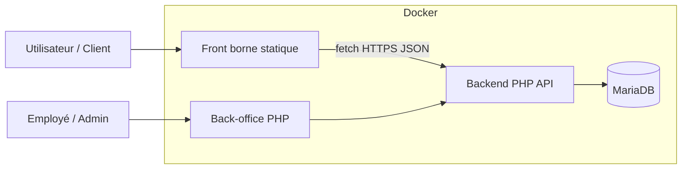
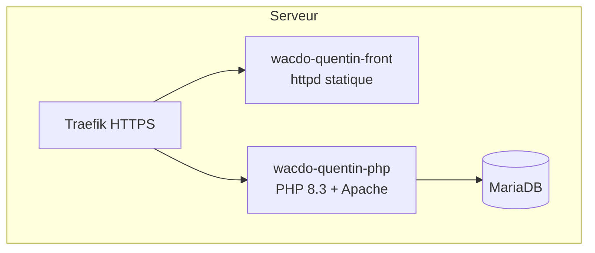
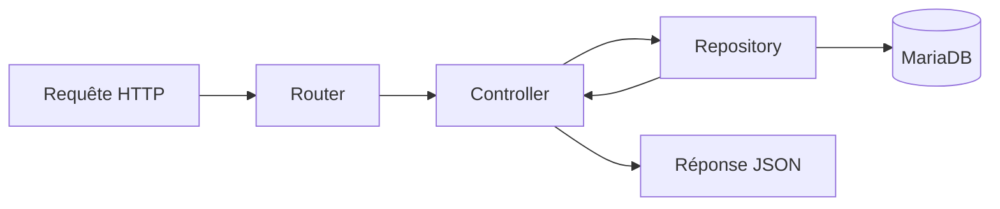
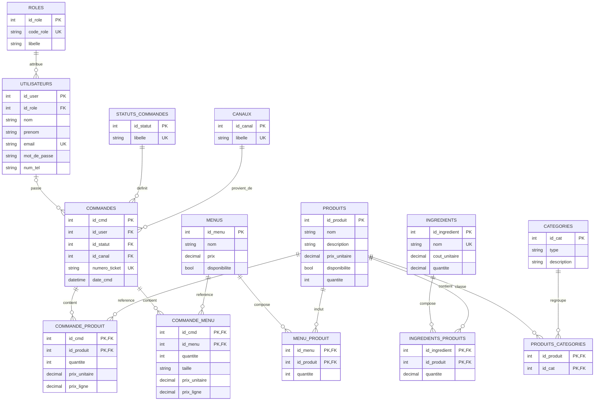
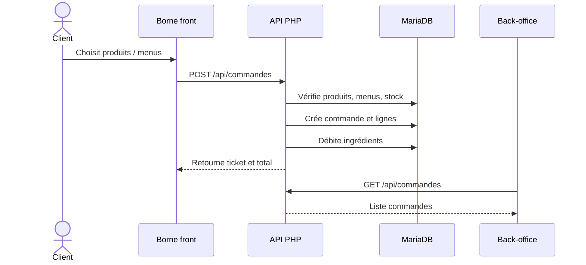
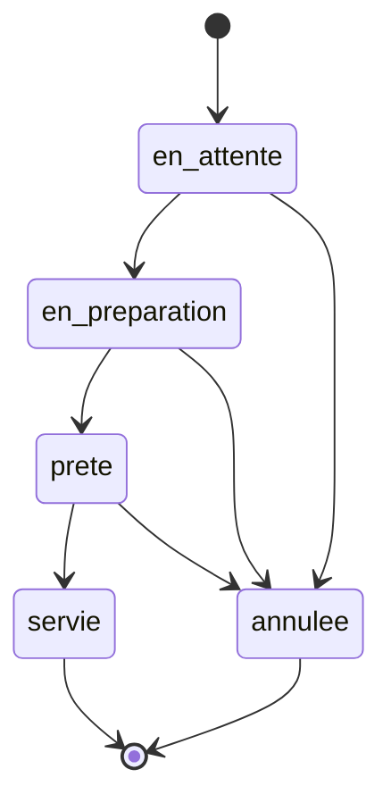
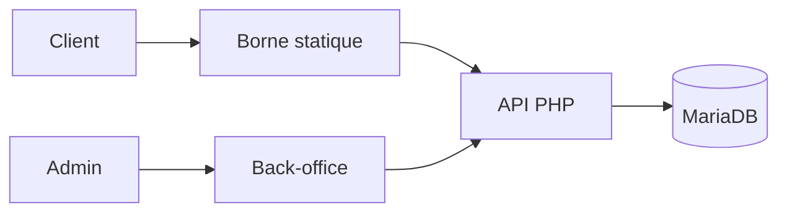

# Brief Claude - Présentation PowerPoint Projet WACDO

Ce fichier est destiné à être donné à Claude ou à une autre IA pour générer une présentation PowerPoint complète du projet WACDO.

Objectif : produire un support clair, professionnel, soutenable à l'oral, avec schémas, architecture, MCD, choix techniques, méthode SONCAS, état actuel, limites et perspectives.

Important :

- Ne pas inclure de vrais identifiants dans la présentation.
- Ne pas présenter le projet comme totalement terminé.
- Dire que le backend est fonctionnel en MVP.
- Dire que le front actuel est en HTML/CSS/JavaScript vanilla, et qu'un framework front est prévu/en préparation pour une future version.
- La présentation doit rester pédagogique : expliquer les choix simplement.

---

## 1. Informations Générales

### Nom Du Projet

WACDO

### Type De Projet

Application web de commande inspirée d'une borne de restauration rapide.

### Objectif Général

Permettre à un client de passer une commande depuis une borne, puis permettre à un employé, manager ou administrateur de consulter et suivre les commandes dans un back-office.

### Interfaces Principales

1. Borne client :
   - choix sur place / à emporter ;
   - affichage catalogue ;
   - ajout produits / menus ;
   - panier ;
   - envoi commande à l'API.

2. Back-office :
   - connexion ;
   - consultation commandes ;
   - détail commande ;
   - changement statut ;
   - consultation catalogue ;
   - modification produit / menu / ingrédient ;
   - consultation utilisateurs.

3. API backend :
   - catalogue ;
   - commandes ;
   - authentification ;
   - produits ;
   - menus ;
   - ingrédients ;
   - utilisateurs.

---

## 2. État Actuel Du Projet

### Fonctionnel Aujourd'hui

- Backend PHP opérationnel.
- API REST accessible.
- Base MariaDB structurée.
- Back-office fonctionnel.
- Authentification par session PHP.
- Gestion de rôles : `EMPLOYE`, `MANAGER`, `ADMIN`.
- Routes sensibles protégées.
- Catalogue chargé depuis la base.
- Images stockées en base et renvoyées sous forme de `data:image/...`.
- Création de commande depuis la borne.
- Calcul des prix côté serveur.
- Gestion des statuts de commande.
- Débit du stock ingrédient lors de la création d'une commande.
- Recrédit du stock en cas d'annulation.
- Front borne connecté à l'API.

### Pas Encore Totalement Terminé

- Le front visuel doit encore être finalisé pour coller totalement à la maquette.
- Les choix avancés de menu ne sont pas encore stockés en base :
  - accompagnement ;
  - boisson incluse ;
  - sauces.
- La taille de boisson `30 Cl / 50 Cl` et le supplément associé ne sont pas encore modélisés côté backend.
- Le numéro de chevalet n'est pas encore enregistré en base.
- Un framework front est prévu/en préparation pour structurer une future version plus maintenable.
- Les tests automatisés ne sont pas encore complets.
- La gestion avancée des comptes n'est pas finalisée.
- La journalisation des actions administrateur reste une perspective.

---

## 3. Stack Technique

### Frontend Actuel

- HTML
- CSS
- JavaScript vanilla

### Frontend Prévu

Un framework front est prévu/en préparation pour une version ultérieure.

Objectif du futur framework :

- mieux organiser les composants ;
- faciliter la maintenance ;
- gérer plus proprement l'état du panier ;
- rendre le front plus évolutif ;
- préparer une interface plus robuste et réutilisable.

Formulation orale possible :

> Le front actuel est volontairement simple, en HTML/CSS/JavaScript vanilla, pour valider le fonctionnement avec l'API. Une évolution avec un framework front est prévue afin de rendre l'interface plus maintenable et plus modulaire.

### Backend

- PHP 8.3
- Architecture MVC simple
- Programmation orientée objet
- PDO pour la base de données
- API REST JSON

### Base De Données

- MariaDB
- Modèle relationnel

### Infrastructure

- Docker
- Apache
- Conteneur front statique `httpd`
- Traefik pour l'exposition HTTPS

---

## 4. Pourquoi Ces Choix Techniques ?

### Pourquoi PHP ?

PHP est adapté au développement web côté serveur.

Choix défendable :

- langage adapté aux API web ;
- simple à déployer avec Apache ;
- permet de montrer clairement la logique backend ;
- bon support de PDO pour MariaDB ;
- pas besoin de framework lourd pour ce MVP.

Phrase orale :

> J'ai choisi PHP vanilla pour comprendre et montrer les mécanismes principaux : routage, contrôleurs, repositories, sessions, JSON et accès base de données.

### Pourquoi MariaDB ?

MariaDB est une base relationnelle.

Elle est adaptée car le projet contient beaucoup de relations :

- une commande contient des produits ;
- une commande contient des menus ;
- un menu contient des produits ;
- un produit dépend d'ingrédients ;
- un utilisateur possède un rôle ;
- une commande possède un statut et un canal.

Phrase orale :

> Le modèle relationnel est cohérent avec WACDO, car les données sont liées entre elles. MariaDB permet de structurer ces liens avec des clés primaires, clés étrangères et tables d'association.

### Pourquoi Docker ?

Docker permet d'isoler les services.

Le projet utilise plusieurs conteneurs :

- conteneur PHP/API/back-office ;
- conteneur front statique ;
- conteneur MariaDB.

Phrase orale :

> Docker évite les écarts d'environnement. Le projet tourne avec les mêmes services et versions, que ce soit en local ou sur le serveur.

### Pourquoi Séparer Front Et Back ?

Le front borne est indépendant du backend.

Avantages :

- meilleure séparation des responsabilités ;
- le front consomme une API ;
- le backend reste responsable de la sécurité, des prix et du stock ;
- le conteneur front n'expose pas le code PHP.

Phrase orale :

> La borne client ne décide pas de la logique métier. Elle prépare la commande, mais le backend vérifie, calcule et enregistre.

---

## 5. Architecture Générale

### Schéma De Déploiement



### Schéma Des Conteneurs



### Schéma MVC Simplifié



### Structure Du Projet

```txt
Wacdo_quentin/
  index.php                         Point d'entrée backend
  index.html                        Front borne statique
  docker-compose.yml                Orchestration Docker
  config/
    database.php                    Connexion PDO
  app/
    Controllers/                    Contrôleurs HTTP
    Models/                         Objets métier
    Repositories/                   Accès SQL
    Http/                           Router, JSON, CORS
    Security/                       Session et rôles
    Views/                          Back-office PHP
  assets/
    css/borne.css                   Style borne
    js/borne.js                     Logique borne
    css/back-office.css             Style back-office
    js/back-office.js               Logique back-office
  wacdo/
    architecture/                   MCD, MLD, MPD, diagrammes
    images/                         Assets visuels
```

---

## 6. Architecture Backend

### Point D'entrée

Fichier :

```txt
index.php
```

Rôle :

- charger l'autoload ;
- gérer le CORS ;
- créer la connexion PDO ;
- instancier les repositories ;
- instancier les contrôleurs ;
- déclarer les routes ;
- dispatcher la requête.

### Contrôleurs

Chemin :

```txt
app/Controllers/
```

Contrôleurs principaux :

- `ApiController.php` : catalogue, produits, menus, santé API ;
- `CommandeController.php` : création, liste, détail et statut des commandes ;
- `AuthController.php` : login, logout, session courante ;
- `IngredientController.php` : lecture et modification stock ingrédients ;
- `UtilisateurController.php` : lecture/création utilisateurs ;
- `HomeController.php` : affichage du back-office.

### Repositories

Chemin :

```txt
app/Repositories/
```

Repositories principaux :

- `DbCommandeRepository.php`
- `DbProduitRepository.php`
- `DbMenuRepository.php`
- `DbIngredientRepository.php`
- `DbUtilisateurRepository.php`
- `DbCategorieRepository.php`

Rôle :

- isoler les requêtes SQL ;
- éviter le SQL directement dans les contrôleurs ;
- garder une architecture lisible.

### Models

Chemin :

```txt
app/Models/
```

Exemples :

- `Produit`
- `Menu`
- `Commande`
- `CommandeProduit`
- `CommandeMenu`
- `Ingredient`
- `Utilisateur`
- `Role`
- `Canal`
- `Categorie`
- `StatutCommande`

---

## 7. API Principale

### Catalogue

```txt
GET /api/catalogue
GET /api/categories
GET /api/produits
GET /api/produits/{id}
GET /api/menus
```

### Commandes

```txt
POST  /api/commandes
GET   /api/commandes
GET   /api/commandes/{id}
PATCH /api/commandes/{id}/statut
```

### Authentification

```txt
POST /api/auth/login
POST /api/auth/logout
GET  /api/auth/me
```

### Back-Office

```txt
GET   /api/utilisateurs
POST  /api/utilisateurs
GET   /api/ingredients
PATCH /api/ingredients/{id}
PATCH /api/produits/{id}
PATCH /api/menus/{id}
```

---

## 8. MCD - Modèle Conceptuel De Données

Source du MCD existant :

```txt
wacdo/architecture/MCD.mmd
```

### MCD Mermaid



### Lecture Simple Du MCD

- Un utilisateur possède un rôle.
- Un utilisateur peut passer plusieurs commandes.
- Une commande possède un statut.
- Une commande provient d'un canal.
- Une commande peut contenir des produits.
- Une commande peut contenir des menus.
- Un menu est composé de produits.
- Un produit est rattaché à des catégories.
- Un produit consomme des ingrédients.

---

## 9. MLD - Modèle Logique De Données

Tables principales :

- `roles`
- `utilisateurs`
- `statuts_commandes`
- `canaux`
- `commandes`
- `produits`
- `menus`
- `categories`
- `ingredients`
- `commande_produit`
- `commande_menu`
- `menu_produit`
- `ingredients_produits`
- `produits_categories`

### Tables D'association

Les relations plusieurs-à-plusieurs sont représentées par des tables d'association :

- `commande_produit`
- `commande_menu`
- `menu_produit`
- `ingredients_produits`
- `produits_categories`

### Exemple De Relation

Un menu peut contenir plusieurs produits, et un produit peut être dans plusieurs menus.

Cela donne :

```txt
menus -> menu_produit -> produits
```

---

## 10. MPD - Modèle Physique De Données

Source :

```txt
wacdo/architecture/MPD.sql
```

Le MPD est écrit pour MariaDB.

Exemples de choix techniques :

- `INT UNSIGNED AUTO_INCREMENT` pour les identifiants ;
- `DECIMAL(10,2)` pour les prix ;
- `TINYINT(1)` pour la disponibilité ;
- `MEDIUMBLOB` pour les images ;
- clés primaires ;
- clés étrangères ;
- contraintes d'unicité.

### Exemple De Table Commande

```sql
CREATE TABLE commandes (
  id_cmd INT UNSIGNED AUTO_INCREMENT PRIMARY KEY,
  id_user INT UNSIGNED NULL,
  id_statut INT UNSIGNED NOT NULL,
  id_canal INT UNSIGNED NOT NULL,
  numero_ticket VARCHAR(30) NOT NULL,
  date_cmd DATETIME NOT NULL DEFAULT CURRENT_TIMESTAMP,
  total_ttc DECIMAL(10,2) NOT NULL DEFAULT 0.00
);
```

---

## 11. Parcours D'une Commande

### Parcours Fonctionnel



### Étapes Backend

Lorsqu'une commande est créée :

1. L'API reçoit le payload JSON.
2. Le contrôleur valide les données.
3. Le repository ouvre une transaction.
4. Le backend vérifie produits et menus.
5. Le backend calcule le prix.
6. Le backend insère la commande.
7. Le backend insère les lignes.
8. Le backend débite les ingrédients.
9. Le backend met à jour le total.
10. Le backend valide la transaction.

Point clé à dire :

> Le front ne décide pas du total final. Le backend recalcule le prix et vérifie le stock.

---

## 12. Workflow Des Statuts



Statuts :

- `en_attente`
- `en_preparation`
- `prete`
- `servie`
- `annulee`

Choix :

- une commande ne se supprime pas ;
- elle change d'état ;
- l'annulation permet de recréditer le stock.

---

## 13. Sécurité Et Authentification

### Authentification

Le back-office utilise une session PHP.

Routes :

```txt
POST /api/auth/login
POST /api/auth/logout
GET  /api/auth/me
```

### Rôles

Rôles autorisés :

- `EMPLOYE`
- `MANAGER`
- `ADMIN`

### Routes Protégées

- consultation commandes ;
- détail commande ;
- changement statut ;
- modification produits ;
- modification menus ;
- modification ingrédients ;
- consultation utilisateurs.

### Justification

Le client peut créer une commande sans compte, mais il ne doit pas pouvoir accéder aux données de gestion.

Phrase orale :

> La création de commande est publique pour la borne, mais les routes d'administration sont protégées par session et rôle.

---

## 14. Stock Et Ingrédients

Les produits sont associés à des ingrédients.

Lorsqu'une commande est créée :

- le backend calcule les ingrédients nécessaires ;
- il vérifie les quantités disponibles ;
- il débite le stock.

Si la commande est annulée :

- le backend recrédite les ingrédients.

Phrase orale :

> Le stock est géré côté serveur pour éviter qu'un utilisateur puisse modifier le front et créer une commande incohérente.

---

## 15. Front Borne Actuel

Fichiers :

```txt
index.html
assets/css/borne.css
assets/js/borne.js
```

Fonctions principales :

- `chargerProduits()`
- `afficherOnglets()`
- `afficherProduits()`
- `afficherPanier()`
- `envoyerCommande()`
- `ouvrirModale()`
- `fermerModales()`

Le front actuel :

- charge le catalogue depuis l'API ;
- affiche les catégories ;
- affiche les produits ;
- gère le panier ;
- envoie les commandes ;
- reste compatible avec le backend actuel.

Limite assumée :

> Le front ne réactive pas encore toutes les options de la maquette tant que le backend ne sait pas les stocker proprement.

---

## 16. Back-Office Actuel

Fichiers :

```txt
app/Views/back_office.php
assets/css/back-office.css
assets/js/back-office.js
```

Fonctionnalités :

- connexion ;
- affichage des commandes ;
- détail d'une commande ;
- changement de statut ;
- consultation catalogue ;
- modification produit/menu ;
- consultation ingrédients ;
- modification quantité ingrédient ;
- consultation utilisateurs.

---

## 17. SONCAS Du Projet

SONCAS est une méthode commerciale qui permet de présenter la valeur du projet selon plusieurs motivations : Sécurité, Orgueil, Nouveauté, Confort, Argent, Sympathie.

### S - Sécurité

Arguments :

- routes back-office protégées ;
- authentification par session ;
- rôles employés/managers/admins ;
- calcul des prix côté serveur ;
- stock géré côté serveur ;
- transactions SQL pour éviter les commandes incomplètes.

Phrase :

> Le projet sécurise les actions sensibles et garde le backend comme source de vérité.

### O - Orgueil

Arguments :

- projet structuré en MVC ;
- séparation front/back ;
- architecture Docker ;
- API REST ;
- base relationnelle modélisée ;
- logique de commande complète pour un MVP.

Phrase :

> Le projet montre une vraie architecture, pas seulement des pages statiques.

### N - Nouveauté

Arguments :

- borne interactive ;
- catalogue dynamique ;
- back-office connecté ;
- images stockées en base ;
- futur framework front en préparation ;
- architecture évolutive.

Phrase :

> Le projet est prêt à évoluer vers une interface front plus moderne avec framework.

### C - Confort

Arguments :

- parcours client simple ;
- panier clair ;
- commande suivie dans le back-office ;
- changement de statut rapide ;
- centralisation des données.

Phrase :

> Le projet simplifie le parcours de commande et le suivi côté employé.

### A - Argent

Arguments :

- suivi des prix ;
- calcul serveur fiable ;
- limitation des erreurs de stock ;
- réduction des pertes liées aux commandes incohérentes ;
- possibilité de modifier les prix produits/menus.

Phrase :

> Le backend évite les erreurs de prix et de stock, ce qui protège la rentabilité.

### S - Sympathie

Arguments :

- interface inspirée d'une borne connue ;
- expérience client familière ;
- ton visuel accessible ;
- projet compréhensible pour un jury non technique.

Phrase :

> Le projet reprend des codes connus par les utilisateurs, ce qui rend l'expérience plus intuitive.

---

## 18. Forces Du Projet

- Backend fonctionnel.
- API REST claire.
- Architecture MVC simple.
- Séparation front/back.
- Dockerisation.
- Base relationnelle modélisée.
- Authentification et rôles.
- Stock ingrédients.
- Commandes avec statuts.
- Back-office utilisable.
- Front connecté à l'API.
- Évolutivité prévue avec futur framework front.

---

## 19. Limites Actuelles

- Front visuel encore à finaliser.
- Options avancées de menu non stockées.
- Taille boisson non modélisée côté backend.
- Numéro chevalet non enregistré.
- Tests automatisés incomplets.
- Gestion avancée utilisateurs non terminée.
- Journalisation admin non implémentée.
- Framework front encore en préparation.

Formulation conseillée :

> Le projet est fonctionnel en MVP. Les choix principaux sont en place, mais certaines fonctionnalités avancées restent à finaliser pour une version production.

---

## 20. Perspectives

### Court Terme

- Finaliser le modèle backend pour :
  - chevalet ;
  - options menu ;
  - taille boisson ;
  - sauces.
- Adapter le front au nouveau contrat API.
- Améliorer le back-office pour afficher toutes les options.
- Ajouter des tests automatisés plus complets.

### Moyen Terme

- Migrer le front vers un framework.
- Découper l'interface en composants.
- Mieux gérer l'état du panier.
- Ajouter historique des actions admin.
- Ajouter gestion avancée des utilisateurs.

### Long Terme

- Tableau de bord statistique.
- Gestion complète des stocks.
- Gestion de plusieurs restaurants.
- Interface employé cuisine.
- Système de notification des commandes.

---

## 21. Plan De Présentation PowerPoint Conseillé

### Slide 1 - Titre

Titre :

> WACDO - Borne de commande et back-office

Sous-titre :

> Projet PHP / MariaDB / Docker avec front client et API REST

Contenu :

- nom du projet ;
- nom étudiant ;
- contexte examen.

### Slide 2 - Problématique

Question :

> Comment permettre à un client de passer une commande simplement, tout en donnant au restaurant un outil de suivi fiable ?

Points :

- commande côté client ;
- suivi côté employé ;
- gestion du stock ;
- sécurité back-office.

### Slide 3 - Objectifs

Objectifs :

- afficher un catalogue ;
- créer une commande ;
- calculer le total côté serveur ;
- suivre les statuts ;
- protéger le back-office ;
- gérer produits, menus et ingrédients.

### Slide 4 - Stack Technique

Afficher :

- HTML/CSS/JS vanilla ;
- futur framework front en préparation ;
- PHP 8.3 ;
- MariaDB ;
- Docker ;
- Apache ;
- API REST JSON.

### Slide 5 - Architecture Générale

Utiliser le schéma :



### Slide 6 - Structure Du Projet

Afficher l'arborescence :

```txt
index.php
index.html
app/Controllers
app/Models
app/Repositories
assets/js
assets/css
config/database.php
wacdo/architecture
```

### Slide 7 - MCD

Afficher le MCD simplifié.

Message :

- utilisateurs ;
- rôles ;
- commandes ;
- produits ;
- menus ;
- ingrédients ;
- statuts ;
- canaux.

### Slide 8 - Parcours Commande

Afficher la séquence :

1. client choisit produits ;
2. front envoie commande ;
3. API vérifie ;
4. base enregistre ;
5. stock débité ;
6. back-office suit la commande.

### Slide 9 - Sécurité

Points :

- session PHP ;
- rôles ;
- routes protégées ;
- prix recalculé côté serveur ;
- stock côté serveur.

### Slide 10 - Back-Office

Points :

- login ;
- liste commandes ;
- détail commande ;
- changement statut ;
- catalogue ;
- ingrédients ;
- utilisateurs.

### Slide 11 - SONCAS

Table :

| Axe | Argument |
|---|---|
| Sécurité | Auth, rôles, prix serveur |
| Orgueil | Architecture MVC + Docker |
| Nouveauté | Borne dynamique + futur framework |
| Confort | Parcours simple |
| Argent | Prix et stock maîtrisés |
| Sympathie | Interface familière |

### Slide 12 - État Actuel

Deux colonnes :

Fait :

- API ;
- commandes ;
- stock ;
- auth ;
- back-office ;
- front connecté.

À finaliser :

- options menu ;
- taille boisson ;
- chevalet ;
- front final ;
- framework front ;
- tests.

### Slide 13 - Perspectives

Court terme :

- finaliser contrat front/back ;
- stocker options avancées ;
- finir le visuel.

Moyen terme :

- framework front ;
- composants ;
- dashboard ;
- historique admin.

### Slide 14 - Conclusion

Message :

> WACDO est un MVP fonctionnel qui montre une architecture complète : front, API, back-office, base relationnelle, sécurité, commandes et stock. Le projet est prêt à évoluer vers une version plus complète avec un framework front et une gestion avancée des options.

---

## 22. Prompt Direct Pour Claude

Tu peux donner ce prompt à Claude avec ce fichier :

```txt
À partir du document fourni, crée une présentation PowerPoint professionnelle pour un examen de projet informatique.

Contraintes :
- Présentation en français.
- 12 à 14 slides.
- Style clair, moderne, pédagogique.
- Inclure des schémas d'architecture.
- Inclure un MCD simplifié.
- Inclure une slide SONCAS.
- Inclure une slide forces / limites.
- Inclure une slide perspectives.
- Mentionner que le front actuel est en HTML/CSS/JavaScript vanilla et qu'un framework front est prévu/en préparation.
- Ne pas présenter le projet comme totalement terminé.
- Insister sur le fait que le backend est source de vérité pour les prix, le stock et la sécurité.
- Préparer des notes orales courtes pour chaque slide.

Sortie attendue :
- plan slide par slide ;
- contenu exact de chaque slide ;
- notes orales ;
- suggestion de design ;
- proposition de schémas en Mermaid ou équivalent.
```

---

## 23. Notes Orales Courtes

### Intro

> WACDO est une application de commande avec une borne client, une API backend et un back-office.

### Architecture

> J'ai séparé le front statique du backend pour avoir une borne légère qui consomme une API.

### Backend

> Le backend est en PHP vanilla avec une architecture MVC simple : contrôleurs, modèles et repositories.

### Base

> MariaDB est adaptée car le projet repose sur des relations : commandes, produits, menus, ingrédients et utilisateurs.

### Sécurité

> Les routes sensibles sont protégées par session et rôles. La borne peut créer une commande, mais ne peut pas gérer le back-office.

### Stock

> Le stock est géré côté serveur. À la commande, les ingrédients sont débités ; à l'annulation, ils sont recrédités.

### Limites

> Le projet est fonctionnel en MVP, mais il reste des éléments à finaliser comme les options avancées de menu, la taille de boisson et le framework front.

### Conclusion

> Le projet montre une architecture complète et évolutive, avec un backend solide et une base prête pour les prochaines fonctionnalités.

