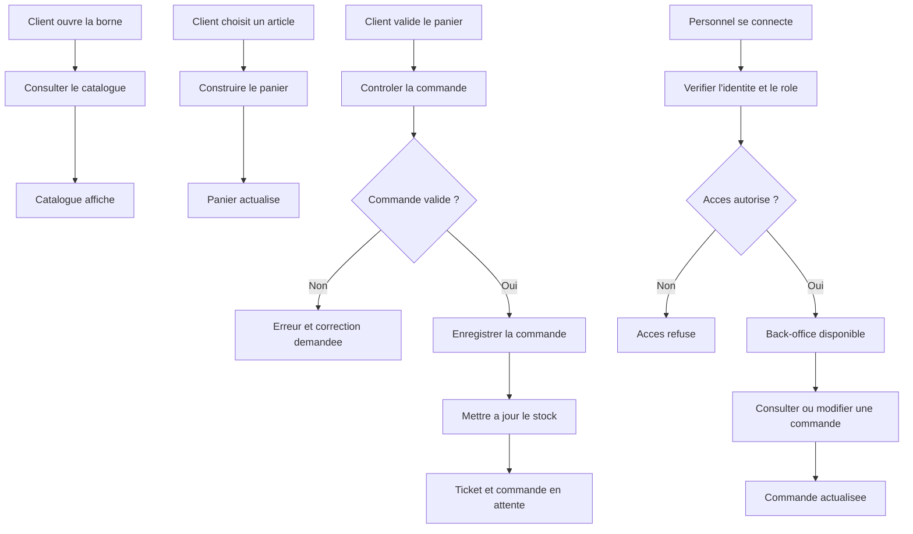

# WACDO - MCT

## Modele conceptuel des traitements

Le modele conceptuel des traitements decrit les evenements, les acteurs, les traitements et les resultats du projet sans dependre de PHP, de React ou de MariaDB.

Le projet est organise autour de deux espaces :

- la borne client pour composer une commande ;
- le back-office pour suivre les commandes et administrer les donnees.

## 1. Acteurs

| Acteur | Role |
|---|---|
| Client | Consulte le catalogue et compose une commande. |
| Employe | Consulte les commandes et fait avancer leur preparation. |
| Manager | Suit les commandes et modifie les donnees utiles au fonctionnement. |
| Administrateur | Gere les utilisateurs, les roles et les donnees sensibles. |
| Systeme | Controle les regles, enregistre les donnees et retourne un resultat. |

## 2. Evenements et resultats

| Evenement declencheur | Traitement conceptuel | Resultat attendu |
|---|---|---|
| Le client ouvre la borne | Charger le catalogue disponible | Categories et articles affiches |
| Le client choisit une categorie | Filtrer le catalogue | Produits ou menus de la categorie affiches |
| Le client ajoute un article | Ajouter l'article au panier | Panier et total mis a jour |
| Le client modifie le panier | Recalculer le panier | Quantites et total actualises |
| Le client choisit le mode de service | Memoriser le mode choisi | Commande preparee avec le mode associe |
| Le client choisit de se connecter | Verifier son compte client | Session client ouverte |
| Le client choisit de creer un compte | Creer un compte avec le role CLIENT | Compte cree et session ouverte |
| Le client choisit de continuer sans compte | Conserver la commande anonyme | Commande sans utilisateur associee |
| Le client valide le panier | Controler et enregistrer la commande | Commande creee et ticket genere |
| Un article est indisponible | Refuser l'article ou demander une correction | Message d'erreur et panier corrige |
| Un employe se connecte | Verifier son identite et son role | Acces au back-office autorise ou refuse |
| Un employe consulte les commandes | Rechercher les commandes | Liste et details affiches |
| Un employe change un statut | Controler la transition | Statut de commande mis a jour |
| Un manager modifie le catalogue | Controler puis enregistrer la modification | Produit ou menu actualise |
| Une commande est annulee | Annuler la commande et retablir le stock concerne | Commande annulee, stock corrige |
| Un administrateur gere un compte | Controler les droits et enregistrer le compte | Utilisateur cree ou modifie |

## 3. Regles conceptuelles

### 3.1 Consultation du catalogue

**Evenement :** le client ouvre la borne ou selectionne une categorie.

**Traitement :**

1. charger les categories et les articles disponibles ;
2. regrouper les articles par categorie ;
3. afficher le nom, le prix et l'image ;
4. masquer les articles indisponibles.

**Resultat :** le client peut consulter une offre a jour.

### 3.2 Composition du panier

**Evenement :** le client selectionne un produit ou un menu.

**Traitement :**

1. identifier l'article choisi ;
2. verifier qu'il est disponible ;
3. ajouter ou modifier sa quantite ;
4. recalculer le sous-total et le total ;
5. afficher le panier actualise.

**Resultat :** le panier correspond aux choix du client.

### 3.3 Validation d'une commande

**Evenement :** le client valide son panier.

**Traitement :**

1. verifier que le panier contient au moins un article ;
2. verifier l'existence des produits et des menus ;
3. verifier leur disponibilite ;
4. verifier les quantites ;
5. recalculer le prix de reference ;
6. creer la commande ;
7. enregistrer les lignes de commande ;
8. diminuer le stock necessaire ;
9. attribuer le statut initial ;
10. generer un numero de ticket.

**Resultat :** une commande valide est enregistree avec un ticket et le statut `en_attente`.

### 3.4 Authentification facultative du client

**Evenement :** le client choisit de se connecter, de creer un compte ou de continuer sans compte avant la validation.

**Traitement :**

1. verifier les identifiants d'un compte existant ; ou
2. creer un compte avec le role `CLIENT` ; ou
3. conserver l'absence de session pour une commande anonyme ;
4. associer automatiquement la commande au compte client si une session est active.

**Resultat :** les trois parcours sont disponibles sans imposer la creation d'un compte.

### 3.5 Authentification du personnel

**Evenement :** un utilisateur envoie son identifiant et son mot de passe.

**Traitement :**

1. rechercher le compte ;
2. comparer le mot de passe avec son hash ;
3. regenerer la session apres une connexion valide ;
4. charger le role de l'utilisateur ;
5. autoriser ou refuser l'acces.

**Resultat :** une session de travail est ouverte ou un message d'erreur est retourne.

### 3.6 Suivi d'une commande

**Evenement :** un employe consulte ou met a jour une commande.

**Traitement :**

1. identifier la commande ;
2. consulter son statut courant ;
3. verifier que la nouvelle transition est autorisee ;
4. enregistrer le nouveau statut ;
5. retourner la commande actualisee.

**Resultat :** la commande suit un cycle coherent :

```text
en_attente -> en_preparation -> prete -> servie
       \\-> annulee
```

### 3.7 Gestion du catalogue et du stock

**Evenement :** un manager modifie un produit, un menu ou un ingredient.

**Traitement :**

1. verifier l'identite et le role ;
2. verifier les donnees recues ;
3. verifier l'existence de l'element ;
4. enregistrer la modification ;
5. retourner la nouvelle valeur.

**Resultat :** le catalogue ou le stock est actualise sans contourner les regles d'acces.

## 4. Vue globale des traitements



## 5. Etat actuel de la borne

Le traitement conceptuel reste le meme que la borne soit construite en JavaScript vanilla ou avec React.

Dans la version actuellement presentee :

- le catalogue de la borne est charge par l'API ;
- le client peut se connecter avec un compte `CLIENT` ;
- le client peut creer un compte `CLIENT` ;
- le client peut continuer sans compte ;
- la session client est associee automatiquement a la commande ;
- la confirmation de commande est retournee par l'API ;
- le back-office utilise le backend PHP et la base MariaDB.

Le fonctionnement est donc relie de bout en bout pour le parcours client principal. Les options avancees de composition des menus restent un sujet distinct du compte client.
