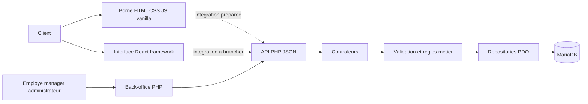
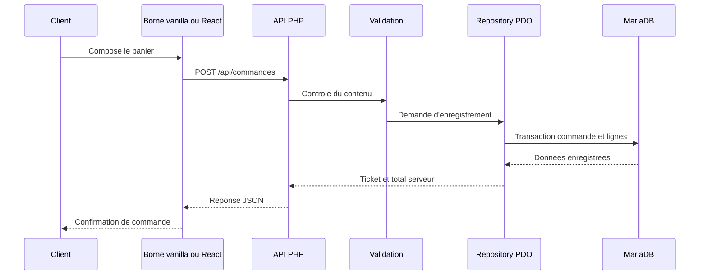

# WACDO - MLT

## Modele logique des traitements

Le modele logique des traitements traduit le MCT dans l'organisation reelle de l'application. Il identifie les interfaces, les routes, les composants PHP, les repositories et les donnees manipulees.

Le MLT ne depend pas d'une seule interface : la borne vanilla et la future interface React peuvent utiliser le meme backend PHP et le meme contrat API.

## 1. Architecture logique



Les pointilles indiquent que la borne actuelle n'est pas branchee en permanence sur l'API. Le backend et ses routes constituent neanmoins la cible logique commune aux deux interfaces.

## 2. Correspondance entre acteurs et interfaces

| Acteur | Interface logique | Acces |
|---|---|---|
| Client | Borne vanilla actuelle | Consultation locale du catalogue et parcours de panier |
| Client | Borne React | Future interface composant la commande |
| Employe | Back-office web | Consultation et suivi des commandes |
| Manager | Back-office web | Catalogue, commandes et stock |
| Administrateur | Back-office web | Utilisateurs, roles et donnees sensibles |

## 3. Traitements de la borne

### 3.1 Charger le catalogue

| Element | Implementation logique |
|---|---|
| Declencheur | Initialisation de la borne |
| Interface | Vanilla actuelle ou React futur |
| Source actuelle | `wacdo/produits.json` |
| Route API preparee | `GET /api/catalogue` |
| Transformation | Normaliser les produits, menus, categories et images |
| Sortie | Catalogue affiche par categorie |
| Erreur | Message indiquant que le catalogue est indisponible |

### 3.2 Construire le panier

| Element | Implementation logique |
|---|---|
| Declencheur | Clic sur un produit ou un menu |
| Module | Etat du panier de l'interface |
| Donnees lues | Identifiant, nom, prix, quantite, options disponibles |
| Traitements | Ajouter, supprimer, modifier la quantite, recalculer le total |
| Sortie | Panier et total affiches |
| Regle | Le total affiche par l'interface ne remplace pas le controle serveur |

### 3.3 Envoyer la commande

| Element | Implementation logique |
|---|---|
| Declencheur | Validation du panier |
| Interface actuelle | Envoi API avec choix compte client ou invite |
| Route cible | `POST /api/commandes` |
| Controleur cible | Controleur API des commandes |
| Validation | Produits, menus, quantites, disponibilite et donnees de commande |
| Persistance | `COMMANDES`, `COMMANDE_PRODUIT`, `COMMANDE_MENU` |
| Stock | Decrement des ingredients concernes |
| Sortie | Numero de ticket et commande au statut `en_attente` |

## 4. Authentification client facultative

| Traitement | Route | Controle logique | Resultat |
|---|---|---|---|
| Connexion client | `POST /api/auth/client-login` | Verification du compte et du role `CLIENT` | Session client ouverte |
| Creation de compte client | `POST /api/auth/register` | Validation des champs et creation forcee avec le role `CLIENT` | Compte et session ouverts |
| Commande invite | Aucun appel d'authentification | Absence de session acceptee | `COMMANDES.id_user` reste nul |

Lorsqu'une session client est active, la commande est associee au compte cote serveur. L'identifiant utilisateur n'est pas pris dans le contenu transmis par le navigateur.

## 5. Authentification du personnel

| Traitement | Route | Controle logique | Resultat |
|---|---|---|---|
| Connexion | `POST /api/auth/login` | Recherche du compte et verification du hash | Session ouverte ou erreur |
| Utilisateur courant | `GET /api/auth/me` | Lecture de la session | Profil et role retournes |
| Deconnexion | `POST /api/auth/logout` | Destruction de la session | Session fermee |

La session est utilisee pour proteger les fonctions du back-office. Les mots de passe ne sont pas compares en clair : le backend verifie le mot de passe par rapport a un hash.

## 6. Traitements du back-office

### 5.1 Consulter les commandes

| Element | Implementation logique |
|---|---|
| Acteur | Employe, manager ou administrateur |
| Routes | `GET /api/commandes`, `GET /api/commandes/{id}` |
| Controle | Session valide et role autorise |
| Repositories | Lecture des commandes et de leurs lignes |
| Donnees | Commande, ticket, date, statut, canal, produits et menus |
| Sortie | Liste ou detail retourne au back-office |

### 5.2 Changer le statut d'une commande

| Element | Implementation logique |
|---|---|
| Acteur | Employe, manager ou administrateur |
| Route | `PATCH /api/commandes/{id}/statut` |
| Controle | Session, role et identifiant valide |
| Regle | La transition doit respecter le cycle de commande |
| Donnee modifiee | `COMMANDES.id_statut` |
| Sortie | Commande avec son nouveau statut |

### 5.3 Modifier le catalogue

| Element | Produits | Menus |
|---|---|---|
| Route de lecture | `GET /api/produits` | `GET /api/menus` |
| Route de modification | `PATCH /api/produits/{id}` | `PATCH /api/menus/{id}` |
| Controle | Acces back-office et validation des champs |
| Donnees modifiees | Nom, prix, disponibilite, quantite selon le cas | Nom, prix, disponibilite selon le cas |
| Persistance | Table `PRODUITS` | Table `MENUS` |

### 5.4 Gerer les ingredients et les utilisateurs

| Traitement | Routes logiques | Donnees principales |
|---|---|---|
| Consulter ou modifier le stock | `GET/PATCH /api/ingredients` | `INGREDIENTS` |
| Consulter les utilisateurs | `GET /api/utilisateurs` | `UTILISATEURS`, `ROLES` |
| Creer un utilisateur | `POST /api/utilisateurs` | `UTILISATEURS`, role associe |

## 7. Donnees utilisees par les traitements

| Traitement | Lecture | Ecriture |
|---|---|---|
| Catalogue | `CATEGORIES`, `PRODUITS`, `MENUS` | Aucune |
| Panier | Donnees catalogue et etat interface | Etat local de l'interface |
| Creation commande | Catalogue, disponibilite, ingredients | `COMMANDES`, lignes de commande, stock |
| Connexion | `UTILISATEURS`, `ROLES` | Session PHP |
| Suivi commande | `COMMANDES`, statuts et lignes | `COMMANDES.id_statut` |
| Catalogue | `PRODUITS`, `MENUS` | Produits et menus modifies |
| Stock | `INGREDIENTS` et relations produit-ingredient | Quantites d'ingredients |
| Utilisateurs | `UTILISATEURS`, `ROLES` | Nouvel utilisateur ou modification autorisee |

## 8. Flux logique d'une commande API



Dans la version actuellement presentee, la borne s'arrete avant l'appel API et produit une confirmation locale. Le sequence diagram represente le flux logique prepare et le fonctionnement du backend lorsque le branchement est active.

## 9. Gestion des erreurs

Le traitement logique doit retourner une reponse explicite dans les cas suivants :

- article introuvable ;
- article indisponible ;
- quantite invalide ;
- panier vide ;
- identifiant invalide ;
- utilisateur non authentifie ;
- role insuffisant ;
- transition de statut interdite ;
- erreur de connexion a la base ;
- donnees invalides.

Les erreurs sont distinguees entre :

- erreur de saisie ou de validation ;
- ressource absente ;
- acces refuse ;
- erreur technique du serveur.

## 10. Vanilla et React dans le MLT

Le MLT conserve le meme backend pour les deux interfaces.

### Borne vanilla

- interface HTML/CSS/JavaScript directe ;
- etat gere dans `assets/js/borne.js` ;
- catalogue charge via l'API ;
- choix de connexion, inscription ou commande invite ;
- confirmation retournee par l'API.

### Interface React

- composants pour l'accueil, les categories, les articles, le panier et le ticket ;
- etat de commande gere de maniere structuree ;
- contrat API reutilisable ;
- possibilite de remplacer progressivement le rendu vanilla sans modifier la base metier PHP.

React modifie l'organisation du front, pas les responsabilites du backend. Les cadres noirs visibles sur une capture sont un choix graphique de presentation et ne constituent pas une consequence technique du vanilla.

## 11. Synthese

Le MCT decrit ce que le systeme doit faire : consulter, composer, controler, enregistrer et suivre une commande.

Le MLT decrit comment ces traitements sont repartis dans l'application :

```text
Borne vanilla ou React
        -> requete HTTP JSON
API PHP
        -> controleur et validation
Repositories PDO
        -> requetes SQL
MariaDB
        -> reponse JSON
Interface et utilisateur
```

Cette separation permet de conserver la meme logique metier lorsque l'interface evolue de la version vanilla vers une version utilisant React.
